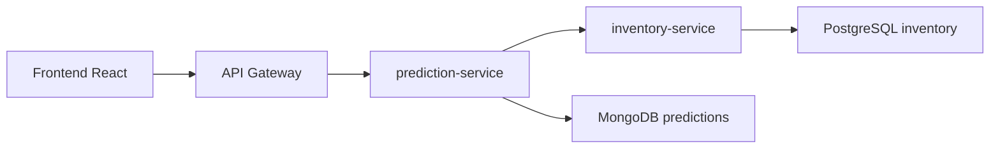

# Integración local con FarmaExpres

## Objetivo

Ejecutar `prediction-service` como parte del ecosistema FarmaExpres, consumiendo datos desde `inventory-service` y exponiendo resultados por el `api-gateway`.

## Flujo oficial



MongoDB no consulta PostgreSQL directamente. La extracción la hace Python por HTTP interno hacia `inventory-service`.

## 1. Levantar backend principal

```bash
cd ../FarmaExpres_Backend
docker compose --env-file .env.dev up -d --build
```

Para otros ambientes:

```bash
docker compose --env-file .env.qa up -d --build
docker compose --env-file .env.main up -d --build
```

Servicios esperados:

- `api-gateway`: `http://localhost:8080`
- `inventory-service`: interno `http://inventory-service:8082`
- PostgreSQL: `localhost:5433`

## 2. Levantar prediction-service

```bash
cd ../FarmaExpres-Micro-NoSQL
docker compose --env-file .env.dev up -d --build
```

Este comando levanta `mongo` y `prediction-service` dentro del mismo grupo Docker del backend. En Docker Desktop deben aparecer en `farmaexpres-dev`, junto con `postgres`, `api-gateway`, `inventory-service` y los demás servicios principales.

El repositorio ya incluye `.env.dev`, `.env.qa` y `.env.main` para ejecución local. Los archivos `.env.*.example` quedan como referencia si el equipo necesita reconstruirlos.

La variable clave es:

```text
BACKEND_COMPOSE_PROJECT_NAME=farmaexpres-dev
BACKEND_NETWORK=farmaexpres-dev_default
```

Equivalencias por ambiente:

- `dev`: `BACKEND_NETWORK=farmaexpres-dev_default`, gateway `http://localhost:8080`, MongoDB `mongodb://localhost:27017`.
- `qa`: `BACKEND_NETWORK=farmaexpres-qa_default`, gateway `http://localhost:9080`, MongoDB `mongodb://localhost:37017`.
- `main`: `BACKEND_NETWORK=farmaexpres-main_default`, gateway `http://localhost:10080`, MongoDB `mongodb://localhost:47017`.

Con esa red, el gateway del backend puede resolver:

```text
http://prediction-service:8000
```

Para apagar este bloque sin afectar otros contenedores del mismo proyecto, se usa:

```bash
docker compose --env-file .env.dev down
```

No se debe usar `--remove-orphans` desde un solo repositorio porque el backend principal y el backend predictivo comparten el nombre de proyecto Docker.

## 3. Probar por gateway

Primero obtener token:

```bash
curl -X POST http://localhost:8080/api/auth/login \
  -H "Content-Type: application/json" \
  -d '{"email":"temenico5@gmail.com","password":"admin123"}'
```

Luego ejecutar:

```bash
TOKEN="PEGAR_TOKEN_AQUI"

curl http://localhost:8080/api/predictions/health

curl -X POST http://localhost:8080/api/predictions/ingest \
  -H "Authorization: Bearer $TOKEN" \
  -H "Content-Type: application/json" \
  -d '{"source":"inventory"}'

curl -X POST http://localhost:8080/api/predictions/clean \
  -H "Authorization: Bearer $TOKEN"

curl -X POST http://localhost:8080/api/predictions/train \
  -H "Authorization: Bearer $TOKEN" \
  -H "Content-Type: application/json" \
  -d '{"horizon_days":7}'

curl http://localhost:8080/api/predictions \
  -H "Authorization: Bearer $TOKEN"
```

## 4. Frontend principal

El frontend integrado consume el gateway con rutas relativas:

```text
/api/predictions
```

El módulo visual queda dentro de `FarmaExpres-Frontend`, no como una aplicación separada para usuarios finales.

Para levantarlo por Docker:

```bash
cd ../FarmaExpres-Frontend/frontend
docker compose --env-file .env.dev up -d --build
```

Para QA o main:

```bash
docker compose --env-file .env.qa up -d --build
docker compose --env-file .env.main up -d --build
```

## 5. Herramientas locales de apoyo

El frontend estático de este repositorio se conserva como tablero auxiliar de diagnóstico:

```bash
cd ../FarmaExpres-Micro-NoSQL
docker compose --env-file .env.dev -f docker-compose.frontend.yml up -d --build
```

```text
http://localhost:5174
```

Ese contenedor se llama `prediction-frontend` y aparece dentro del grupo `farmaexpres-frontend-dev`, junto con el `frontend` principal. Para `qa` y `main` se usan los mismos comandos cambiando el archivo `.env`.

Los datos generados por `POST /seed-test-data` y el fallback `RELATIONAL_DB_URL` son solo para pruebas técnicas. La integración oficial usa `inventory-service`.
