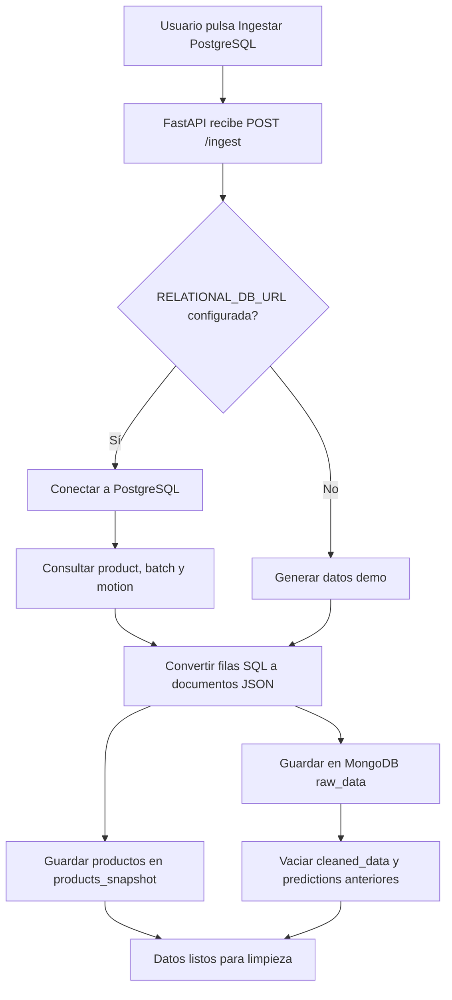
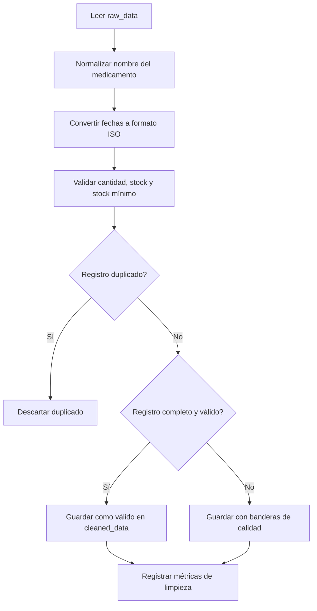
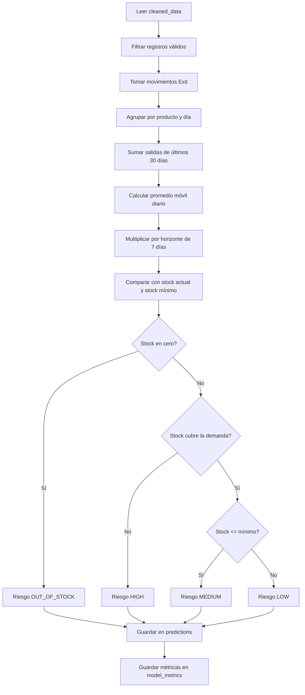
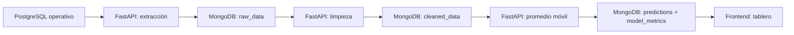

# Libro de la base de datos no relacional

Este documento explica, en lenguaje sencillo, cómo el microservicio usa MongoDB para apoyar el análisis predictivo de FarmaExpres. La idea no es reemplazar PostgreSQL ni el backend principal, sino crear una capa NoSQL donde se puedan guardar datos procesados, limpiar información y calcular una primera predicción de demanda.

## 1. Punto de partida

FarmaExpres ya tiene una base relacional en PostgreSQL. Esa base es buena para el funcionamiento diario del sistema porque guarda productos, lotes, movimientos y usuarios con reglas claras.

Para el corte de base de datos no relacional se necesitaba algo distinto:

- guardar datos crudos sin cambiar el modelo relacional;
- transformar esos datos sin tocar el backend principal;
- almacenar datos limpios para análisis;
- guardar predicciones y métricas del modelo;
- permitir pruebas con muchos datos simulados.

Por eso se creó este microservicio independiente con MongoDB.

## 2. Qué datos se toman de la base relacional

La revisión del backend principal mostró que la base útil para predicción es `farmaexpres_inventory`.

| Tabla relacional | Por qué sirve |
| --- | --- |
| `product` | Contiene medicamento, código, stock, precio, stock mínimo y fecha de vencimiento. |
| `batch` | Contiene lotes, stock disponible y vencimientos por producto. |
| `motion` | Contiene entradas y salidas del inventario. Las salidas `Exit` se usan como aproximación de demanda. |

No se encontró una tabla formal de ventas u órdenes. Por eso el modelo no afirma que predice ventas reales; predice demanda aproximada a partir de movimientos de salida del inventario.

## 3. Cómo se comunica PostgreSQL con MongoDB

La comunicación ocurre desde el backend del microservicio. MongoDB no se conecta por sí solo a PostgreSQL; quien hace el puente es la API en FastAPI.

El proceso es:

1. El usuario ejecuta `POST /ingest`.
2. FastAPI revisa si existe `RELATIONAL_DB_URL`.
3. Si existe, se conecta a PostgreSQL.
4. Ejecuta consultas sobre `product`, `batch` y `motion`.
5. Convierte cada fila relacional en documentos tipo JSON.
6. Guarda los documentos en MongoDB.
7. Limpia colecciones derivadas para no mezclar predicciones viejas con datos nuevos.



## 4. Modelado NoSQL usado

El modelado usado es por colecciones orientadas al flujo de análisis. No se intenta copiar exactamente todas las tablas relacionales; se guardan documentos más flexibles según el estado del dato.

| Colección | Qué representa | Para qué se usa |
| --- | --- | --- |
| `raw_data` | Datos crudos importados o generados. | Mantener evidencia de la fuente antes de limpiar. |
| `products_snapshot` | Foto de productos relevantes. | Tener stock, código, categoría y stock mínimo al entrenar. |
| `cleaned_data` | Datos normalizados y validados. | Alimentar el modelo predictivo. |
| `predictions` | Resultado por medicamento. | Mostrar demanda, riesgo y días hasta agotamiento. |
| `model_metrics` | Métricas de limpieza y entrenamiento. | Explicar qué tan útil fue el proceso. |

Ejemplo simple de documento en `raw_data`:

```json
{
  "source": "postgres",
  "product_id": "12",
  "product_code": "FXT-0012",
  "product_name": "Acetaminofén 500 mg",
  "movement_type": "Exit",
  "amount": 6,
  "movement_date": "2026-05-01T10:30:00",
  "stock": 42,
  "minimum_stock": 10,
  "batch_code": "TEST-FXT-0012"
}
```

Ejemplo simple de documento en `predictions`:

```json
{
  "product_id": "12",
  "product_name": "Acetaminofén 500 mg",
  "current_stock": 42,
  "horizon_days": 7,
  "moving_average_daily": 5.4,
  "predicted_demand_units": 38,
  "estimated_stockout_days": 7.8,
  "risk_level": "MEDIUM",
  "method": "30_day_moving_average"
}
```

## 5. Tratamiento y limpieza de datos

Antes de predecir, los datos pasan por limpieza. Esto es importante porque un modelo, aunque sea sencillo, puede dar resultados malos si recibe datos duplicados, fechas dañadas o cantidades negativas.

La función principal está en `backend/app/services/cleaning.py`.

| Paso | Qué hace | Por qué importa |
| --- | --- | --- |
| Normalizar nombres | Quita espacios extra, pasa a mayúsculas y elimina variaciones de acentos para comparar. | Evita que el mismo medicamento se vea como dos productos distintos. |
| Convertir fechas | Pasa fechas a formato estándar ISO. | Permite ordenar movimientos por día. |
| Validar cantidades | Detecta cantidades nulas o negativas. | Una venta negativa dañaría la demanda. |
| Validar stock | Detecta stock vacío o negativo. | El riesgo de agotamiento depende del stock. |
| Eliminar duplicados | Usa producto, tipo de movimiento, fecha, cantidad y lote. | Evita contar dos veces la misma salida. |
| Marcar calidad | Guarda `is_valid` y `quality_flags`. | No oculta problemas; los deja explicables. |



## 6. Algoritmo predictivo

El modelo actual usa promedio móvil de 30 días. Es una técnica estadística sencilla y explicable.

La idea es responder:

> Si el medicamento ha salido del inventario con cierto ritmo durante los últimos días, ¿cuántas unidades podrían necesitarse en los próximos 7 días?

La función principal está en `backend/app/services/prediction.py`.

### Pasos del algoritmo

1. Leer `cleaned_data`.
2. Ignorar registros inválidos.
3. Tomar solo movimientos `Exit`.
4. Agrupar salidas por producto y por día.
5. Sumar las unidades de los últimos 30 días.
6. Dividir entre 30 para obtener demanda diaria promedio.
7. Multiplicar por el horizonte de predicción, por defecto 7 días.
8. Comparar la demanda esperada contra el stock actual.
9. Clasificar el riesgo del producto.
10. Guardar el resultado en `predictions`.

Fórmula usada:

```text
demanda_diaria_promedio = salidas_ultimos_30_dias / 30
demanda_esperada_7_dias = techo(demanda_diaria_promedio * 7)
dias_hasta_agotarse = stock_actual / demanda_diaria_promedio
```

Clasificación de riesgo:

| Riesgo | Significado |
| --- | --- |
| `OUT_OF_STOCK` | El producto ya no tiene stock. |
| `HIGH` | El stock no alcanza para cubrir la demanda estimada. |
| `MEDIUM` | El stock está en el mínimo o por debajo del mínimo. |
| `LOW` | El stock alcanza para el horizonte calculado. |



## 7. Qué hace MongoDB dentro del modelo

MongoDB no "entrena" el modelo por sí mismo. Su papel es almacenar y organizar las etapas del dato. El cálculo lo hace FastAPI con Python, pero MongoDB permite que cada etapa quede guardada y consultable.

En otras palabras:

- PostgreSQL es la fuente operativa original.
- FastAPI extrae, transforma y calcula.
- MongoDB guarda el historial analítico: crudo, limpio, predicción y métricas.
- El frontend consulta la API para mostrar los resultados.



## 8. Por qué se tomaron esos datos

Se eligieron los datos que ayudan a responder preguntas de inventario:

| Dato | Motivo |
| --- | --- |
| Código y nombre del producto | Identificar el medicamento. |
| Categoría o forma farmacéutica | Agrupar medicamentos similares en análisis futuros. |
| Stock actual | Saber si la demanda proyectada puede cubrirse. |
| Stock mínimo | Medir cuándo el producto entra en alerta. |
| Movimiento `Exit` | Representar salida del inventario y aproximar demanda. |
| Fecha del movimiento | Construir historial por día. |
| Cantidad | Calcular demanda real de cada salida. |
| Lote y vencimiento | Dejar base para futuras alertas por caducidad. |

## 9. Métricas guardadas

El microservicio guarda dos tipos de métricas:

| Métrica | Explicación sencilla |
| --- | --- |
| Métricas de limpieza | Cuántos datos entraron, cuántos quedaron válidos, cuántos duplicados se quitaron y cuántos registros quedaron con alertas. |
| Métricas de entrenamiento | Cuántos productos se evaluaron, cuántos registros válidos se usaron, método aplicado y error medio aproximado. |

El error medio aproximado compara el comportamiento real de días anteriores contra una predicción simple basada en los 7 días previos. No es una precisión comercial definitiva; es una primera señal para explicar si el modelo está cerca o lejos del historial.

## 10. Limitaciones honestas del modelo

- Usa salidas de inventario como demanda aproximada porque no hay tabla formal de ventas.
- No incluye promociones, temporadas, clima ni eventos externos.
- No reemplaza decisiones humanas de compra.
- No es un modelo avanzado de machine learning.
- Sirve como primera versión funcional y explicable para el corte.

## 11. Cómo explicarlo en sustentación

Una forma fácil de explicarlo:

> Primero revisamos la base relacional del backend principal y vimos que los datos útiles estaban en productos, lotes y movimientos. Como no debíamos modificar ese backend, creamos un microservicio separado. Ese microservicio extrae los datos, los guarda como documentos en MongoDB, limpia errores y duplicados, y luego usa las salidas de inventario de los últimos 30 días para calcular una demanda promedio. Con esa demanda proyecta los próximos 7 días y clasifica el riesgo de agotamiento de cada medicamento.

## 12. Archivos donde está implementado

| Parte | Archivo |
| --- | --- |
| Conexión y carga desde PostgreSQL | `backend/app/services/ingestion.py` |
| Limpieza de datos | `backend/app/services/cleaning.py` |
| Modelo predictivo | `backend/app/services/prediction.py` |
| Endpoints | `backend/app/main.py` |
| Configuración MongoDB | `backend/app/database.py` |
| Frontend de resultados | `frontend/index.html`, `frontend/app.js`, `frontend/styles.css` |

